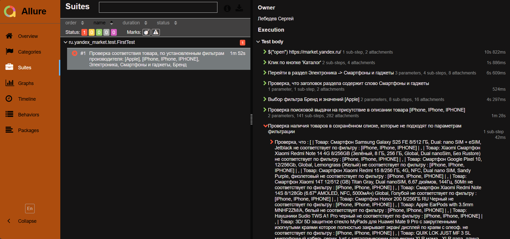

# 🚀 UI Automation Framework (Selenide)

<div align="center">


</div>

<div align="center">

---

> **Сам проект несёт исключительно ознакомительную цель - НЕ НАДО заниматься автоматизацией на реальных сайтах. Используйте для этого специально разработанные площадки.**

</div>

---

## 📋 О проекте

<div align="center">

**Универсальный фреймворк для автоматизации тестирования** с расширенной поддержкой **динамического контента**. Работает с любыми параметрами и устойчив к изменениям DOM-структуры страниц.

</div>

<div align="center">

---

#### Структура сценария: проверка работы поисковой выдачи на основе заданных параметров фильтрации. Если товар на странице не соответствует критерям поиска - позиция сохраняется в список. Шаг `checkedError()` - проверяет наличие, если список не пустой выводит все найденные товары.

 

</div>

### ⚡ Ключевые преимущества
- **🔧 Универсальность** — гибкая работа с любыми параметрами фильтрации
- **🔄 Динамический контент** — интеллектуальная обработка AJAX и пагинации
- **🛡️ Устойчивость** — стабильная работа при изменениях контента страниц
- **📊 Расширенная отчетность** — детальные Allure-отчеты с автоматическими скриншотами


## 🏗 Архитектура

```
src/test/java/
├── 📂 pages/          # Page Object Model
├── 📂 helper/         # Вспомогательные утилиты
├── 📂 config/         # Конфигурация проекта
├── 📂 allure/         # Кастомная интеграция Allure
└── 📂 test/           # Тестовые сценарии
```

## 🚀 Быстрый старт

```bash
mvn clean test
mvn allure:serve
```

<p align="center">
  
</p>

